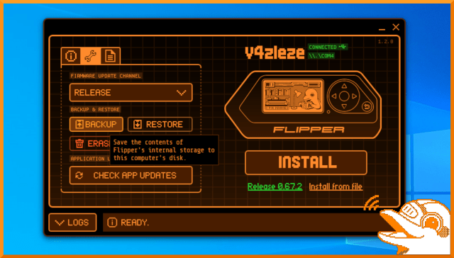
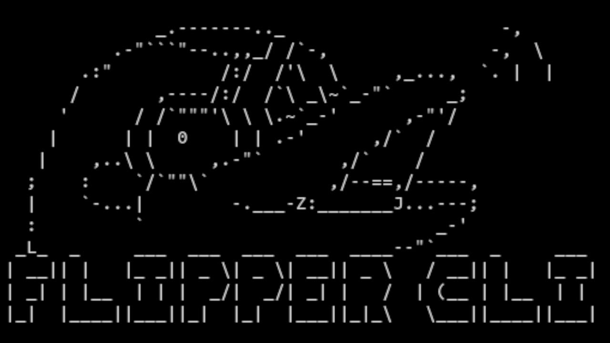
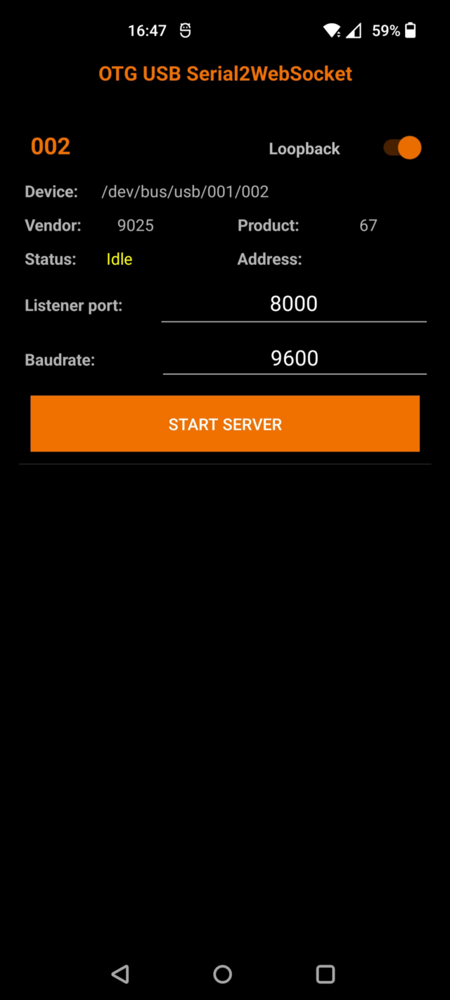
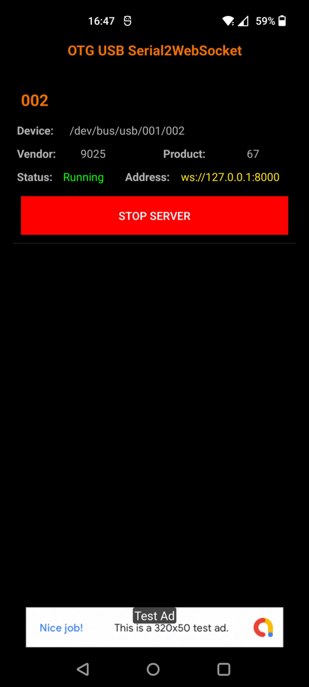

# **Guida programmazione Flipper in Python con pyFlipper**

## **1. Cos'è pyFlipper?**

PyFlipper è una libreria Python che permette di eseguire le funzioni del Flipper attraverso uno script. In gergo tecnico questo approccio viene definito wrapper, in quanto tale libreria si occupa di estendere le funzioni che vengono rese disponibili dalla CLI utilizzando il linguaggio di programmazione Python.

## **2. Cos'è la CLI?**

Command Line Interface, si tratta di una console seriale raggiungibile collegando il Flipper via USB al computer. Questa interfaccia è resa disponibile dal firmware stesso, e permette di usare le funzioni principali del Flipper via PC. 
Per capire meglio cosa sia:

1. Collegare il Flipper al PC via USB
2.  Ottenere il percorso dell'interfaccia seriale del Flipper
	- Il metodo più semplice è quello di aprire qFlipper e leggere affianco al nome del Flipper il nome dell'interfaccia seriale. Esempio
		- Windows: COM4
		- Linux: /dev/ttyACM0

<div align=center></div>

3. Utilizzare un programma con la funzione di console seriale perl'interfaccia ottenuta in precedenza, assicurandosi che il parametro baudrate sia 9600. Esempio:
	- Windows: Putty, Arduino IDE
	- Linux: screen /dev/ttyACM0 (sostituire con la propria interfaccia)
4. Una volta aperta la console sarà visibile il deflino disegnato in ASCII Art come welcome banner.
5. Digitare help e premere INVIO per consultare la lista di comandi.

<div align=center></div>

## **2. Perchè pyFlipper?**

Come abbiamo visto nello step precedente, accedere alle funzioni del Flipper tramite console seriale interattiva pone un limite all'automatizzazione e alla concatenazione delle stesse (scripting). Sarebbe impossibile ad esempio ottenere la lista del file .sub dalla SD card e lanciarli in sequenza senza interagire manualmente con la CLI ad ogni passaggio. Attraverso la libreria PyFlipper, connessione all'interfacciare seriale, esecuzioni e risultati delle operazioni possono essere manipolate automaticamente in Python.


## **3. Installazione pyFlipper**

### Prerequisiti
- Python 3
- Git (opzionale)

### Installazione

1. Aprire il terminale, clonare la repository [pyFlipper](https://github.com/wh00hw/pyFlipper) ed entrare nella cartella clonata:
	- Se non si ha installato Git, scaricare la repositori come archivio zip, ed estrarre il contenuto
```
git clone https://github.com/wh00hw/pyFlipper.git
cd PyFlipper
```

2. Creare ed attivare il virtual environment (opzionale)

Windows
```
python3 -m venv venv
.\venv\Scripts\Activate.ps1
```

Linux
```
python3 -m venv venv
source venv/bin/activate
```

3. Installare i pacchetti richiesti dalla libreria
```
pip install -r requirements.txt
```

## **4. Usare pyFlipper (PC)**

PyFlipper viene importato come una comune libreria Python, nel seguente esempio viene mostrato come importare, instanziare ed eseguire una semplice funzione.

1. Arire un editor di testo e creare un file 'esempio.py' nella cartella pyFlipper
2. Importare la libreria
```
from pyFlipper import PyFlipper
```
3. Instanziare la classe PyFlipper creando l'oggetto di nome 'flipper' che si interfaccia alla seriale e contiene i metodi delle funzioni invocabili
	- Assicurarsi di sostiuire COM4 con la propria interfaccia seriale ottenuta nel capitolo 2
```
flipper = PyFlipper(com="COM4")
```
4. Ora che l'oggetto flipper è instanziato è possibile tutte le funzioni disponibili. Ad esempio per visualizzare tutti i file e le cartelle nella SD Card scrivere:
```
sdcard = flipper.storage.list(path="/ext")
print(sdcard)
```
5. Salvare il file 'esempio.py' e da terminale lanciare il comando
```
python3 esempio.py
```
6. Verrà stampato a schermo l'elenco dei file e cartelle della directory /ext ossia l'SD Card

### Documentazione

Per consultare la lista di tutte le funzioni disponibili è possibile consultare la documentazione della repository ufficiale al seguente link [pyFlipper](https://github.com/wh00hw/pyFlipper)

## **5. pyFlipper Mobile (Android)**

Il Flipper Zero è un dispositivo tascabile, risulta quindi macchinoso doverlo collegare ad un PC ogni volta che si esegue uno script. Nei seguenti step viene mostrato come collegarlo ad Android.

### Prerequisiti
- Cavo USB OTG 

### Installazione

1. Scaricare dal Play Store [OTGSerial2WebSocket](https://play.google.com/store/apps/details?id=com.wh00hw.serial2websocket)
	- Attraverso questa app è possibile esporre l'interfaccia seriale dello smartphone attraverso un server websocket interno al dispositivo. Questo perchè Android non permette l'accesso diretto attraverso l'USB OTG a meno di avere i permessi di root sullo smartphone
2. Collegare il Flipper allo smartphone via USB OTG
3. Avviare OTGSerial2WebSocket
4. Premere "Start Server"
	- Una notifica confermerà l'avvio del server locale sulla porta 8000
5. Scaricare [Termux](https://f-droid.org/repo/com.termux_118.apk) da F-Droid (consigliato)
	- La versione sul Play Store è deprecata e non mantenuta
<div align=center></div>
<div align=center></div>

6. Aprire Termux, aggiornare i pacchetti ed installare python3 e git
```
pkg update && pkg upgrade
pkg install python git
```
7. Una volta installato Python possiamo possiamo ripetere gli step di installazione e creazione dell'esempio dal capitolo 3 con una sola differenza, quando vienere instanziato l'oggetto flipper assicurarsi di usare l'interfaccia seriale esposta sul server websocket lanciato al punto 4
```
flipper = PyFlipper(ws="ws://127.0.0.1:8000")
```

## **FINE**
